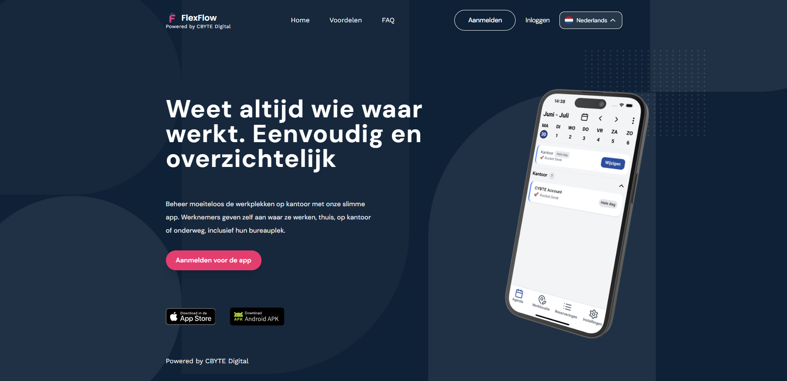

## 🧩 About  
This project was developed as part of a school assignment in collaboration with **Cybte** (Den Bosch), our external client.  
The goal was to create a modern workplace booking system using **.NET MAUI Blazor Hybrid** with Bluetooth-based room detection.  

🔗 [Visit FlexFlow Software](https://flexflow-software.nl)

## 🌐 Landing Page
